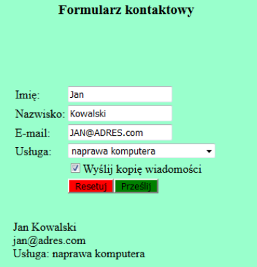

# Pogotowie komputerowe (`E.14-06-19.06`)

Dla fragmentu strony utwórz skrypt, którego wymagania opisano poniżej.

- Wykonywany po stronie przeglądarki, wywoływany przyciskiem „Prześlij”
- Skrypt pobiera wartości wprowadzone do pól formularza. Poniżej formularza, w akapicie, powinno wyświetlić się w pierwszej linii imię i nazwisko, poniżej adres email – zapisany małymi literami, bez względu na to jak zostanie wprowadzony do pola tekstowego, pod nim treść „Usługa: …”, gdzie w miejscu kropek znajduje się nazwa usługi wybranej z listy rozwijalnej, zgodnie z obrazem 3

Obraz 3. Formularz

Źródła i dodatkowe informacje

> **Źródła**: Wymagania dotyczące skryptu (w formie listy punktowanej) oraz obraz 3 są fragmentem arkusza `E.14-06-19.06` dostępnego m.in. pod adresem <https://chr1skyy.github.io/Egzamin-Zawodowy-E14-EE09-INF03/e14/e14_2019_06_06/e_14_2019_06_06.pdf>. Szablon, przykładowa odpowiedź oraz testy zostały przygotowane na potrzeby platformy.

> **Wskazówka do testów:** Dla poprawnego działania testów, należy nie usuwać/zmieniać identyfikatorów `imie`, `nazwisko`, `email`, `usluga`, `kopia-wiadomosci`, `przycisk`.

