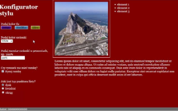
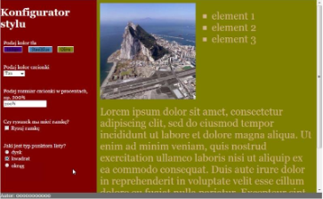

# Konfigurator stylu (`EE.09-06-22.01-SG`)

Dla fragmentu strony utwórz skrypt, którego wymagania opisano poniżej.

- Napisany w języku JavaScript i wykonujący akcje spowodowane zdarzeniami kontrolek. Akcje modyfikują styl CSS bloku prawego i jego elementów, na podstawie przykładu przedstawionego na Obrazie 2b
- Po kliknięciu na dowolny przycisk zmieniający tło, zostaje zmienione tło bloku prawego na kolor odpowiadający podpisowi przycisku
- Po kliknięciu pola wyboru koloru czcionki, zostaje zmieniony kolor czcionki bloku prawego na kolor odpowiadający wyborowi
- Po wpisaniu rozmiaru czcionki i wyjściu z kontrolki (tabulacją lub kliknięciem myszą w obszar poza kontrolką), zmieniany jest rozmiar czcionki dla całego bloku prawego. Nie jest wymagana walidacja tego pola, należy założyć, że pole jest wypełnione poprawnie
- Po kliknięciu w pole checkbox, w zależności od stanu pola, jest dodawane lub usuwane obramowanie obrazu – wymagana realizacja zdarzenia za pomocą funkcji
- Po kliknięciu w pola radio jest ustawiony wybrany rodzaj formatowania punktorów listy

Obraz 2a. Witryna internetowa po załadowaniu w przeglądarce

Obraz 2b. Wybrano kolejno: Olive, Tan, 200%, brak ramki, kwadrat. Ponieważ tekst w prawym panelu nie mieści się, pojawił się pionowy pasek przesuwania

Źródła i dodatkowe informacje

> **Źródła**: Wymagania dotyczące skryptu (w formie listy punktowanej) oraz obrazy 2a i 2b są fragmentem arkusza `EE.09-06-22.01-SG` dostępnego m.in. pod adresem <https://chr1skyy.github.io/Egzamin-Zawodowy-E14-EE09-INF03/ee09/ee09_2022_01_06/ee_09_2022_01_06_SG.pdf>. Obraz gibraltar.jpg pochodzi z załącznika do tego arkusza. Szablon, przykładowa odpowiedź oraz testy zostały przygotowane na potrzeby platformy.

> **Wskazówka do testów:** Dla poprawnego działania testów, należy nie usuwać/zmieniać identyfikatorów `rozmiar-czcionki`, `indigo`, `steel-blue`, `olive`, `kolor-czcionki`, `punktor-dysk`, `punktor-kwadrat`, `punktor-okrag`, `prawy-obraz`, `prawy-lista` i `prawy-akapit`.

