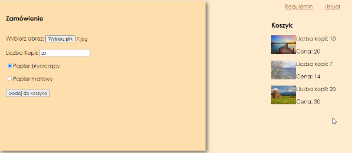

# Fotografia artystyczna (`INF.03-05-25.06-SG`)

Dla fragmentu strony utwórz skrypt, którego wymagania opisano poniżej. Utworzone elementy muszą być w bloku o id `koszyk`.

- Wykonywany po stronie klienta, po kliknięciu przycisku
- Należy stosować znaczące nazewnictwo zmiennych i funkcji w języku polskim lub angielskim
- Pobiera dane z kontrolek
- Oblicza cenę na podstawie liczby kopii i rodzaju papieru. Dla papieru błyszczącego cena jednostkowa wynosi 1,5 zł, dla papieru matowego – 2 zł
- Ustala nazwę pliku z wartości pobranej z pierwszego pola edycyjnego
- Tworzy elementy i dodaje je do bloku [...] (ilustracja 4):
  - Element DOM dla obrazu z ustaloną nazwą pliku
  - Element DOM dla paragrafu z treścią „Liczba kopii: \<kopie\>”, gdzie pole <> jest pobrane z kontrolki
  - Element DOM dla paragrafu z treścią „Cena: \<cena\>”, gdzie pole <> jest wyliczoną ceną

**File Input Type**\
\<input\> elements with type="file" let the user choose one or more files from their device storage. Once chosen, the files can be uploaded to a server using form submission, or manipulated using JavaScript code and the File API. Example:\
`<input type="file" id="plik" accept="image/png, image/jpeg" />`

**Tabela 2. Tworzenie elemenów w JavaScript**

Example\
Create a \<p\> element and append it to the document:

```
const para = document.createElement("p");
para.innerText = "This is a paragraph";
para.className = "nazwaKlasyCSS";
document.body.appendChild(para);
```

Example\
Append an item to a list:

```
const node = document.createElement("li");
/* add text, classes and attributes */
document.getElementById("idListy").appendChild(node);
```

<br>

<center>


**Ilustracja 4. Działanie skryptu – trzy razy wypełniono i zatwierdzono formularz**
</center>

---

> **Przy dodawaniu wzoru, mają działać tylko obrazy, które są w sekcji "Dostępne pliki do użycia w zadaniu". Tak zostało zaprojektowane oryginalnie zadanie z arkusza.**

<details class="source-info">
<summary>Źródła i dodatkowe informacje</summary>

> **Źródła**: Wymagania dotyczące skryptu (w formie listy punktowanej), sekcja "File Input Type", tabela 2 i ilustracja 4 są fragmentem arkusza `INF.03-05-25.06-SG` dostępnego m.in. pod adresem <https://chr1skyy.github.io/Egzamin-Zawodowy-E14-EE09-INF03/inf03/inf03_2025_06_05/inf_03_2025_06_05_SG.pdf>. Obrazy do użycia w zadaniu pochodzą z załacznika do tego arkusza. Szablon, przykładowa odpowiedź oraz testy zostały przygotowane na potrzeby platformy.

> **Wskazówka do testów:** Dla poprawnego działania testów, należy nie usuwać/zmieniać identyfikatorów `wybierz-obraz`, `liczba-kopii`, `papier-blyszczacy`, `papier-matowy`, `przycisk`.

</details>
