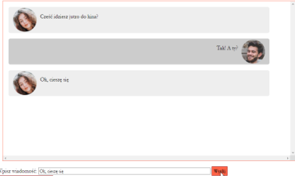
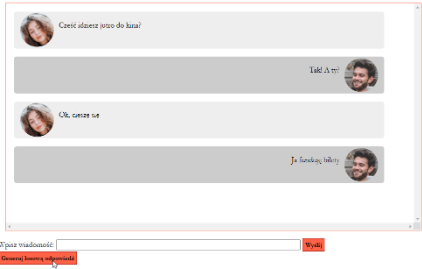

# Chat (`INF.03-02-24.06-SG`)

- Napisany w języku JavaScript
- Należy stosować znaczące nazewnictwo wszystkich zmiennych i funkcji
- Działanie funkcji wywoływanej po kliknięciu przycisku Wyślij:
  - Pobierany jest tekst z pola edycyjnego i umieszczany w oknie chatu jako ostatni
  - Tekst jest formatowany jako wypowiedź Jolanty, zgodnie z obrazem 3, czyli utworzony jest blok z wypowiedzią zawierający obraz Jolka.jpg i paragraf zgodny z tekstem wpisanym do pola edycyjnego
  - Jeśli blok chatu jest cały wypełniony, powinien być przewinięty do nowo wstawionej wypowiedzi
- Działanie funkcji wywoływanej po kliknięciu przycisku „Generuj losową odpowiedź”
  - Losowana jest wypowiedź Krzysztofa z wcześniej zadeklarowanej tablicy. Tablica zawiera 9 elementów, którymi są wypowiedzi. Należy je skopiować z pliku pomocniczego tekstyDoChatu.txt rozpakowanego z archiwum
  - Losowana liczba z przedziału od 0 do 8 jest indeksem tablicy
  - Wypowiedź jest umieszczana w oknie chatu jako ostatnia
  - Tekst jest formatowany jako wypowiedź Krzysztofa, zgodnie z obrazem 4, czyli utworzony jest blok z wypowiedzią zawierający obraz Krzysiek.jpg i paragraf zgodny z wylosowanym tekstem
    − Jeśli blok chatu jest cały wypełniony, powinien być przewinięty do nowo wstawionej wypowiedzi

Zawartość pliku `tekstyDoChatu.txt`:

```
"Świetnie!",
"Kto gra główną rolę?",
"Lubisz filmy Tego reżysera?",
"Będę 10 minut wcześniej",
"Może kupimy sobie popcorn?",
"Ja wolę Colę",
"Zaproszę jeszcze Grześka",
"Tydzień temu też byłem w kinie na Diunie",
"Ja funduję bilety"
```

**Tabela 2. Tworzenie nowych elementów DOM i wstawianie ich do bloków**\
Uwaga: w miejscu element należy wstawić obiekt konkretnego elementu, zwróconego takimi funkcjami jak
getElementById, createElement...

| Kod                                 | Opis                                                                                                                                                      |
| ----------------------------------- | --------------------------------------------------------------------------------------------------------------------------------------------------------- |
| `document.createElement("h2")`      | Tworzy element DOM \<h2\> i zwraca go. Jako parametr należy podać nazwę elementu, np. ul, p, table ...                                                    |
| `element. classList.add("klasa1");` | Przypisuje do danego elementu klasę stylu CSS                                                                                                             |
| `element.nazwa-atrybutu = ...`      | Ustawia wartości atrybutów dla danego elementu                                                                                                            |
| `element.innerText = .... `         | Ustawia tekst dla elementów takich jak paragraf, nagłówek, przycisk itp.                                                                                  |
| `element1.appendChild(element2);`   | Zagnieżdża element2 w elemencie1. Elementem1 może być cały dokument, blok, lista lub inny element agregujący. Wewnątrz niego zostaje umieszczony element2 |
| `element.scrollIntoView();`         | Przewija zawartość bloku / strony do wskazanego elementu                                                                                                  |

<br>

<center>


**Obraz 3. Działanie funkcji wywoływanej kliknięciem przycisku Wyślij**
</center>

<center>


**Obraz 4. Działanie funkcji wywoływanej kliknięciem przycisku Generuj...**
</center>

<details class="source-info">
<summary>Źródła i dodatkowe informacje</summary>

> **Źródła**: Wymagania dotyczące skryptu (w formie listy punktowanej), tabela 2 oraz obrazy 3 i 4 są fragmentem arkusza `INF.03-02-24.06-SG` dostępnego m.in. pod adresem <https://chr1skyy.github.io/Egzamin-Zawodowy-E14-EE09-INF03/inf03/inf03_2024_06_02/inf_03_2024_06_02_SG.pdf>. Obrazy do użycia w zadaniu oraz zawartość pliku tekstyDoChatu.txt pochodzą z załacznika do tego arkusza. Szablon, przykładowa odpowiedź oraz testy zostały przygotowane na potrzeby platformy.

> **Wskazówka do testów:** Dla poprawnego działania testów, należy nie usuwać/zmieniać identyfikatorów `chat`, `tresc`, `przycisk`.

</details>
