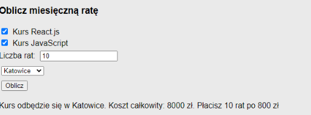

# Kursy komputerowe (`INF.03-01-25.01-SG`)

Dla fragmentu strony utwórz skrypt, którego wymagania opisano poniżej.

- Wykonywany po stronie klienta, [...] po kliknięciu przycisku „Oblicz”
- Należy stosować znaczące nazewnictwo zmiennych i funkcji w języku polskim lub angielskim
- Pobiera dane z kontrolek
- Ustala całkowitą kwotę za wybrane kursy na podstawie cen z tabeli z ilustracji 4
- Oblicza koszt jednej raty na podstawie kwoty całkowitej. Dla uproszczenia kwota całkowita jest dzielona przez podaną liczbę rat
- Wyświetla pod przyciskiem w paragrafie treść: „Kurs odbędzie się w \<miasto\>. Koszt całkowity: \<kwota\> zł. Płacisz \<liczba\> rat po \<rata\> zł”, gdzie
  - \<miasto\> oznacza wybór z listy rozwijalnej
  - \<kwota\> oznacza obliczoną kwotę całkowitą
  - \<liczba\> oznacza podaną liczbę rat
  - \<rata\> oznacza wyliczoną ratę

**Tabela z ilustracji 4**

| Nazwa           | Liczba godzin | Cena |
| :-------------- | :------------ | :--- |
| Kurs React.js   | 220           | 5000 |
| Kurs JavaScript | 150           | 3000 |

 

**Ilustracja 5. [...] Działanie skryptu**

Źródła i dodatkowe informacje

> **Źródła**: Wymagania dotyczące skryptu (w formie listy punktowanej) oraz ilustracja 5 są fragmentem arkusza `INF.03-01-25.01-SG`, dane tabeli "Tabela z ilustracji 4" podchodzą z ilustracji 4 tego arkusza. Arkusz jest dostępny m.in. pod adresem <https://chr1skyy.github.io/Egzamin-Zawodowy-E14-EE09-INF03/inf03/inf03_2025_01_01/inf_03_2025_01_01_SG.pdf>. Szablon, przykładowa odpowiedź oraz testy zostały przygotowane na potrzeby platformy.

> **Wskazówka do testów:** Dla poprawnego działania testów, należy nie usuwać/zmieniać identyfikatorów `react`, `js`, `raty`, `miasto`, `oblicz`, `wynik`. **Wynik działania skryptu umieść w akapicie o id `wynik`.**

