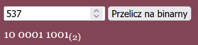

# Konwerter dziesiętnego na binarny (`INF.03-06-25.01-SG`)

Dla fragmentu strony utwórz skrypt, którego wymagania opisano poniżej.

- Napisany w języku wykonywanym po stronie przeglądarki
- Należy stosować znaczące nazewnictwo zmiennych i funkcji w języku polskim lub angielskim
- Wartość, w postaci liczby dziesiętnej, pobraną z pola edycyjnego, przekształca na system binarny
- Wyświetla w paragrafie pod przyciskiem obliczoną liczbę binarną. Liczba binarna jest rozdzielona spacją
  na części (co cztery cyfry począwszy od prawej strony) oraz zakończona oznaczeniem kodu w postaci
  tekstu „(2)”, zapisanym w indeksie dolnym

**Ilustracja 5. Przykład działania skryptu dla liczby dziesiętnej 537**

**Przykład algorytmu zamiany liczby dziesiętnej na binarną**

_K1: Czytaj liczba dziesiętna (L)_\
_K2: Liczba binarna (B) przypisz pusty napis ""_\
_K3: B przypisz L mod 2_\
_K4: L = L/ 2 (zaokrąglona do niższej całkowitej)_\
_K5: Jeśli L = 0 idź do K6; w przeciwnym razie idź do K3_\
_K6: Odwróć napis B tak że ostatnia cyfra staje się pierwszą itd. wypisz B_

**Tabela 1 – wybrane własności i metody obiektu Math**

| Własność / metoda | Opis                                               |
| ----------------- | -------------------------------------------------- |
| Math.PI           | Zwraca wartość stałej Pi (≈ 3,1415)                |
| Math.SQRT2        | Zwraca pierwiastek kwadratowy z liczby 2 (≈ 1,414) |
| Math.abs()        | Zwraca wartość bezwzględną liczby                  |
| Math.ceil()       | Zwraca najmniejszą liczbę całkowitą ≥ argumentu    |
| Math.floor()      | Zwraca największą liczbę całkowitą ≤ argumentu     |
| Math.pow()        | Podnosi pierwszą liczbę do potęgi drugiej          |
| Math.random()     | Zwraca liczbę pseudolosową z przedziału [0, 1)     |
| Math.round()      | Zaokrągla liczbę do najbliższej liczby całkowitej  |
| Math.sqrt()       | Zwraca pierwiastek kwadratowy liczby               |

Źródła i dodatkowe informacje

> **Źródła**: Wymagania dotyczące skryptu (w formie listy punktowanej), ilustracja 5, przykład algorytmu oraz tabela 1 są fragmentem arkusza `INF.03-06-25.01-SG` dostępnego m.in. pod adresem <https://chr1skyy.github.io/Egzamin-Zawodowy-E14-EE09-INF03/inf03/inf03_2025_01_06/inf_03_2025_01_06_SG.pdf>. Szablon, przykładowa odpowiedź oraz testy zostały przygotowane na potrzeby platformy.

> **Wskazówka do testów:** Dla poprawnego działania testów, należy nie zmieniać identyfikatorów `liczba`, `przelicz`, `wynik`.

