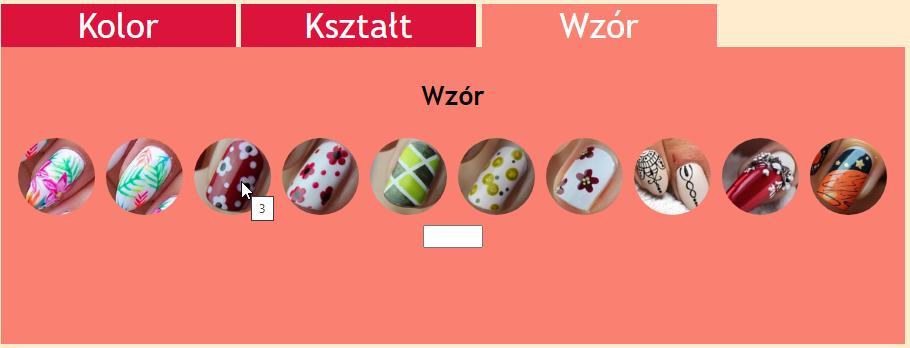

# Wymarzone paznokcie II (`INF.03-09-26.01-SG`)

Dla fragmentu strony utwórz skrypt, którego wymagania opisano poniżej.

- Zapisany w języku JavaScript [...]
- Wyświetla za pomocą pętli 10 obrazów o nazwach, kolejno: 1.jpg, 2.jpg, 3.jpg ... 10.jpg
- Każdy obraz ma przypisaną klasę wzory
- Po najechaniu kursorem na obraz jest wyświetlany dymek z nazwą (numerem) obrazu (na ilustracji 6 wskazano obraz3.jpg, więc dymek zawiera liczbę 3)

**Ilustracja 6. Trzeci blok sekcji z wygenerowanymi obrazami**

Źródła i dodatkowe informacje

> **Źródła**: Wymagania dotyczące skryptów (w formie listy punktowanej) oraz ilustracja 6 są fragmentem arkusza `INF.03-09-26.01-SG` dostępnego m.in. pod adresem <https://chr1skyy.github.io/Egzamin-Zawodowy-E14-EE09-INF03/inf03/inf03_2026_01_09/inf_03_2026_01_09_SG.pdf>. Obrazy do użycia w zadaniu pochodzą z załącznika do tego arkusza. Szablon, przykładowa odpowiedź oraz testy zostały przygotowane na potrzeby platformy.

> Podpowiedź: Jeśli Twoje rozwiązanie tego wymaga, możesz utworzyć blok, w którym będą znajdować się obrazy.
