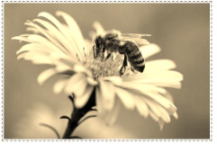
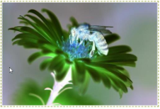
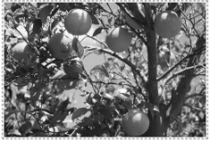
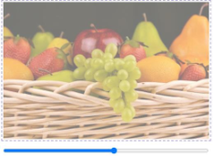
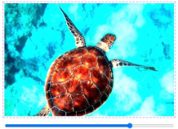

# Efekty na obrazach (`INF.03-12-24.06-SG`)

Dla fragmentu strony utwórz skrypt, którego wymagania opisano poniżej.

- Napisany w języku JavaScript
- Należy stosować znaczące nazewnictwo wszystkich zmiennych i funkcji
- Realizuje transformacje obrazów
- Transformacje obrazu 1:
  - Gdy zaznaczono pole Blur na obraz jest nakładany filtr rozmycia o dowolnej wartości z przedziału 4 px ÷ 8 px
  - Gdy zaznaczono pole Sepia na obraz nakładany jest filtr kolorów sepii (efekt starej fotografii) o wartości 100%
  - Gdy zaznaczono pole Negatyw na obraz nakładany jest filtr odwrócenia kolorów (negatyw) w 100%
- Transformacje obrazu 2:
  - Po wciśnięciu przycisku „Kolorowy" obraz ma zdjęty filtr odcieni szarości
  - Po wciśnięciu przycisku „Czarno-biały" na obraz jest nakładany filtr odcieni szarości o wartości 100%
- Transformacje obrazu 3: Po wciśnięciu przycisku „Zastosuj" na obraz jest nakładany filtr przezroczystości o wartości, która została wskazana suwakiem
- Transformacje obrazu 4: Po wciśnięciu przycisku „Zastosuj" na obraz jest nakładany filtr zmiany jasności o wartości, która została wskazana suwakiem

**Tabela 1. Efekty filtra, kolejno: blur, sepia, negatyw, odcienie szarości, przezroczystość, zmiana jasności**
<table>
    <tbody>
        <tr>
            <td></td>
            <td></td>
            <td></td>
        </tr>
        <tr>
            <td></td>
            <td></td>
            <td></td>
        </tr>
    </tbody>
</table>

**Tabela 3. Przykłady zastosowania właściwości CSS filter ze strony w3schools**

| Filter          | Description                                                                                                                                                                                              |
| --------------- | -------------------------------------------------------------------------------------------------------------------------------------------------------------------------------------------------------- |
| `none`          | Default value. Specifies no effects                                                                                                                                                                      |
| `blur(px)`      | Applies a blur effect to the image. A larger value will create more blur.                                                                                                                                |
| `brightness(%)` | Adjusts the brightness of the image. 0% will make the image completely black. 100% is default and represents the original image. Values over 100% will provide brighter results.                         |
| `contrast(%)`   | Adjusts the contrast of the image. 0% will make the image completely black. 100% (1) is default, and represents the original image. Values over 100% will provide results with more contrast.            |
| `grayscale(%)`  | Converts the image to grayscale. 0% (0) is default and represents the original image. 100% will make the image completely gray (used for black and white images). Note: Negative values are not allowed. |
| `invert(%)`     | Inverts the samples in the image. 0% (0) is default and represents the original image. 100% will make the image completely inverted. Note: Negative values are not allowed                               |
| `opacity(%)`    | Sets the opacity level for the image. The opacity-level describes the transparency- level, where: 0% is completely transparent. 100% (1) is default and represents the original image (no transparency). |
| `sepia(%)`      | Converts the image to sepia. 0% (0) is default and represents the original image. 100% will make the image completely sepia. Note: Negative values are not allowed                                       |

**Examples**\
Apply a blur effect to the image: `img { filter: blur(5px); }`\
Adjust the brightness of the image: `img { filter: brightness(200%); }`

Źródła i dodatkowe informacje

> **Źródła**: Wymagania dotyczące skryptu (w formie listy punktowanej) oraz tabele 1 i 3 są fragmentem arkusza `INF.03-12-24.06-SG` dostępnego m.in. pod adresem <https://chr1skyy.github.io/Egzamin-Zawodowy-E14-EE09-INF03/inf03/inf03_2024_06_12/inf_03_2024_06_12_SG.pdf>. Obrazy do użycia w zadaniu pochodzą z załącznika do tego arkusza. Szablon, przykładowa odpowiedź oraz testy zostały przygotowane na potrzeby platformy.

> **Wskazówka do testów:** Dla poprawnego działania testów, należy nie usuwać/zmieniać identyfikatorów `obraz1`, `obraz2`, `obraz3`, `obraz4`, `blur`, `sepia`, `negatyw`, `zastosuj1`, `kolorowy`, `czarnobialy`, `zakres3`, `zastosuj3`, `zakres4`, `zastosuj4`.

