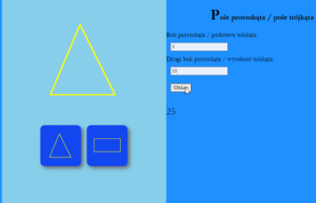
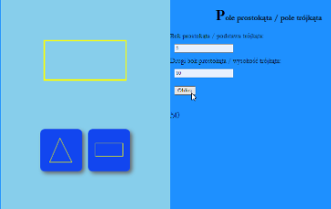

# Pola figur płaskich (`INF.03-03-26.01-SG`)

Dla fragmentu strony utwórz dwa skrypty, którego wymagania opisano poniżej.

Wymagania dotyczące skryptów:

- Wykonywane po stronie klienta
- Należy stosować znaczące nazewnictwo zmiennych i funkcji w języku polskim lub angielskim

Skrypt 1:

- Gdy kliknięto w obraz _1m.bmp_ to duży obraz powyżej ustawiany jest na _1d.bmp_
- Gdy kliknięto w obraz _2m.bmp_ to duży obraz powyżej ustawiany jest na _2d.bmp_

Skrypt 2:

- Pobiera dane z pól edycyjnych
- Gdy w bloku głównym wybrano prostokąt (duży obraz to 2d.bmp), to na podstawie danych jest liczone pole prostokąta [...]
- Gdy w bloku głównym wybrano trójkąt (duży obraz to 1d.bmp) to na podstawie danych jest liczone pole trójkąta [...]
- Obliczenia powinny też działać dla stanu początkowego witryny (Skrypt 1 nie wykonał się ani razu), wtedy liczone jest pole trójkąta
- Wynik wyświetlany jest w paragrafie pod przyciskiem

**Tabela 4. Wybrane wzory na pola figur**
<table>
    <tbody>
        <tr>
            <td>Pole kwadratu</td>
            <td><i>P = a2</i></td>
        </tr>
        <tr>
            <td>Pole prostokąta</td>
            <td><i>P = a × b</i></td>
        </tr>
        <tr>
            <td>Pole trójkąta</td>
            <td><i>P = a × b / 2</i></td>
        </tr>
    </tbody>
</table>

 

**Ilustracja 4. Kliknięto w trójkąt, obliczone pole trójkąta ½ * 5 * 10 = 25**

**Ilustracja 5. Kliknięto w prostokąt, obliczone pole prostokąta 5 * 10 = 50**

Źródła i dodatkowe informacje

> **Źródła**: Wymagania dotyczące skryptów (w formie listy punktowanej), ilustracje 4 i 5 oraz tabela 4 są fragmentem arkusza `INF.03-03-26.01-SG` dostępnego m.in. pod adresem <https://chr1skyy.github.io/Egzamin-Zawodowy-E14-EE09-INF03/inf03/inf03_2026_01_03/inf_03_2026_01_03_SG.pdf>. Obrazy do użycia w zadaniu pochodzą z załącznika do tego arkusza. Szablon, przykładowa odpowiedź oraz testy zostały przygotowane na potrzeby platformy.

> **Wskazówka do testów:** Dla poprawnego działania testów, należy nie usuwać/zmieniać identyfikatorów `pole1`, `pole2`, `przycisk`, `wynik`, `trojkat`, `prostokat`, `wybrana-figura`.

