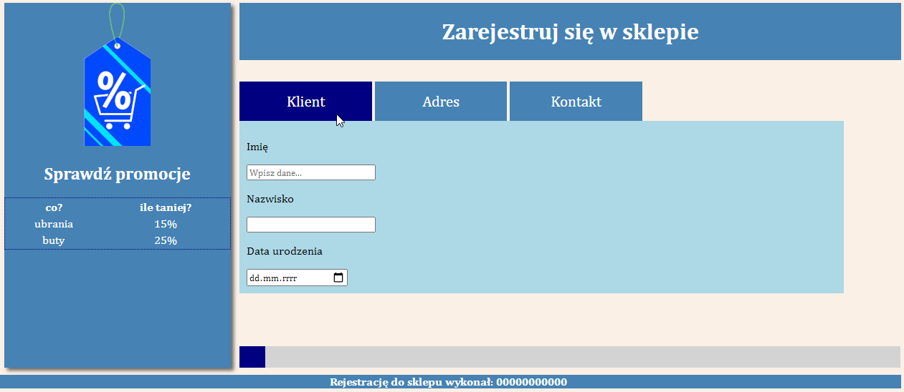
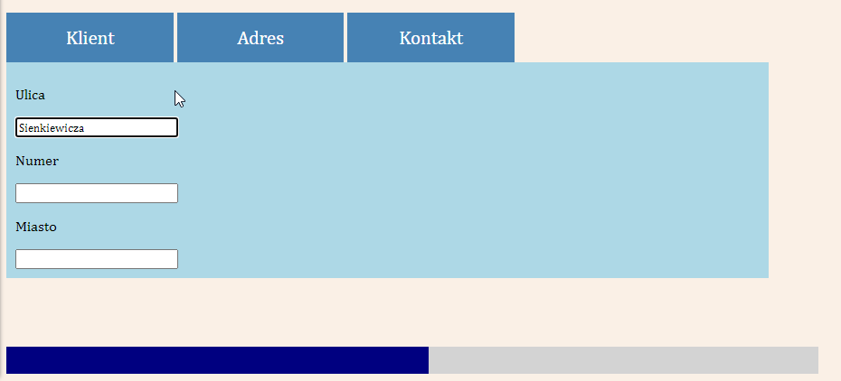
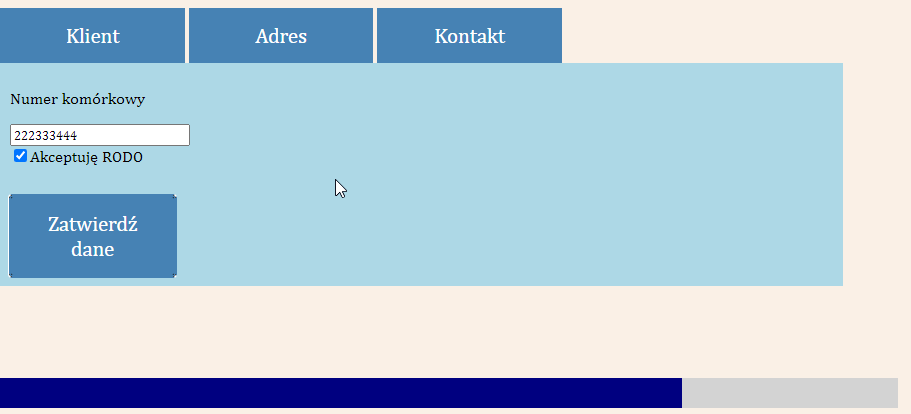
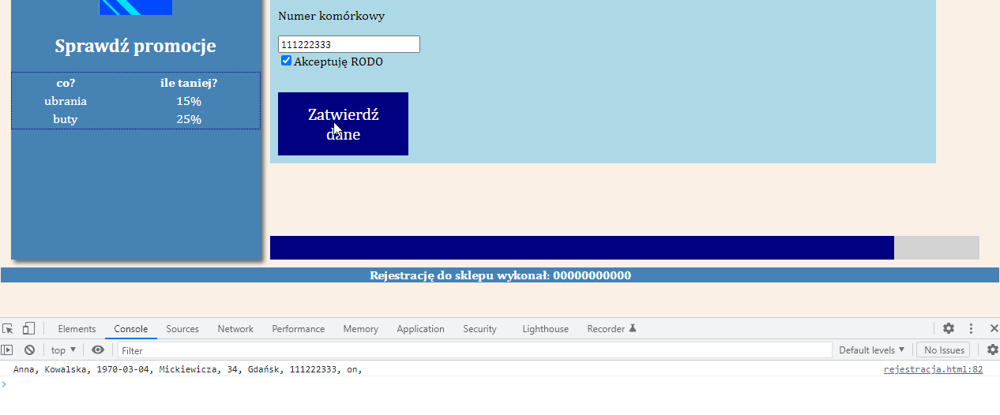

# Rejestracja w sklepie (`INF.03-08-24.06-SG`)

Dla fragmentu strony utwórz skrypt, którego wymagania opisano poniżej.

- Napisany w języku JavaScript
- Należy stosować znaczące nazewnictwo wszystkich zmiennych i funkcji
- Funkcja aktywująca
  - Wywoływana przez wciśnięcie dowolnego przycisku zakładki w bloku głównym
  - Ukrywa wszystkie zakładki
  - Pokazuje jedynie tę zakładkę (blok), której przycisk wybrano. Na obrazach 4 i 5 pokazano stan bloku głównego po wciśnięciu kolejno przycisku Adres i przycisku Kontakt
- Funkcja zmieniająca wartość paska postępu
  - Wywoływana po utracie focusa przez dowolne pole edycyjne
  - Działanie paska postępu polega na zmianie szerokości pustego bloku w bloku paska postępu (obrazy 4 i 5)
  - Funkcja jest uproszczona, zakładamy że każda utrata focusa kontrolki jest równa wpisaniu do niej danych i powoduje zwiększenie szerokości paska (nie sprawdzamy czy dane rzeczywiście zostały wpisane, zostały usunięte itp.)
  - Funkcja modyfikuje właściwość stylu dla pustego bloku wewnątrz bloku paska postępu, w ten sposób, że jego szerokość jest zwiększana o 12%, np. po utracie focusa za pierwszym razem wartość wynosi 16%; za drugim razem jest to 28%, trzecim 40% i tak dalej
  - Należy zabezpieczyć funkcję, aby wartość szerokości nigdy nie była wyższa niż 100%
- Funkcja zatwierdzająca
  - Wywoływana po wybraniu przycisku „Zatwierdź dane”
  - Pobiera wartość z każdego pola edycyjnego i pola wyboru
  - Wartości wyświetlane są w konsoli przeglądarki (obraz 6)
  - Dla uproszczenia wszelką walidację należy pominąć

**Obraz 2. Witryna internetowa. Stan początkowy. Kursor na zakładce Klient**

**Obraz 4. Po wciśnięciu przycisku Adres**

**Obraz 5. Po wciśnięciu przycisku Kontakt**

**Obraz 6. Działanie funkcji zatwierdzającej**

Źródła i dodatkowe informacje

> **Źródła**: Wymagania dotyczące skryptu (w formie listy punktowanej) oraz obrazy 2 i 4-6 są fragmentem arkusza `INF.03-08-24.06-SG` dostępnego m.in. pod adresem <https://chr1skyy.github.io/Egzamin-Zawodowy-E14-EE09-INF03/inf03/inf03_2024_06_08/inf_03_2024_06_08_SG.pdf>. Szablon, przykładowa odpowiedź oraz testy zostały przygotowane na potrzeby platformy.

> **Wskazówka do testów:** Dla poprawnego działania testów, należy nie usuwać/zmieniać identyfikatorów cytatów (`cytat1`, `cytat2`, `cytat3`).

