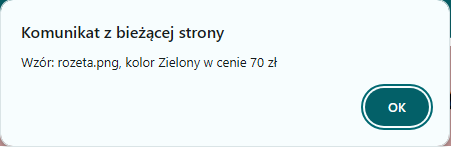
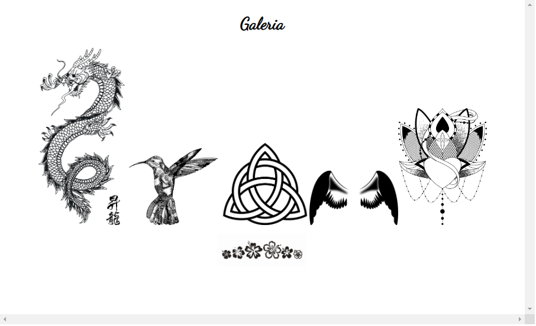

# Studio tatuażu (`INF.03-12-26.01-SG`)

Dla fragmentu strony utwórz skrypt, którego wymagania opisano poniżej.

- Wykonywany po stronie klienta, po kliknięciu przycisku
- Należy stosować znaczące nazewnictwo zmiennych i funkcji w języku polskim lub angielskim
- Pobiera dane z kontrolek
- Ustala nazwę pliku (bez ścieżki dostępu) na podstawie wartości przekazanej z pola do wyboru pliku
- Wyświetla komunikat: "Wzór: \<nazwaPliku\>, kolor \<kolor\> w cenie \<cena\> zł" gdzie pola <> pobrano
  z kontrolek oraz nazwa pliku nie zawiera ścieżki dostępu (Ilustracja 5)
- Tworzy element obrazu i dodaje go do bloku sekcji (ilustracja 6):
  - Źródłem i tekstem alternatywnym jest nazwa pliku
  - Obraz ma przypisaną klasę miniatury

> **File Input Type**\
> \<input\> elements with type="file" let the user choose one or more files from their device storage. Once chosen, the files can be uploaded to a server using form submission, or manipulated using JavaScript code and the File API. Example:\
> `<input type=… accept="file_extension |audio/* |video/* |image/png| image/jpeg|media_type">`\
> JS Value property of input file: _C:\fakepath\fileName.png_

**Ilustracja 5: Komunikat**

**Ilustracja 6: Wygląd bloku sekcji po dodanych kilku plikach**

---

> **Przy dodawaniu wzoru, mają działać tylko obrazy, które są w sekcji "Dostępne pliki do użycia w zadaniu". Tak zostało zaprojektowane oryginalnie zadanie z arkusza.**

Źródła i dodatkowe informacje

> **Źródła**: Wymagania dotyczące skryptu (w formie listy punktowanej), sekcja "File Input Type" oraz ilustracje 5 i 6 są fragmentem arkusza `INF.03-12-26.01-SG` dostępnego m.in. pod adresem <https://chr1skyy.github.io/Egzamin-Zawodowy-E14-EE09-INF03/inf03/inf03_2026_01_12/inf_03_2026_01_12_SG.pdf>. Szablon, przykładowa odpowiedź oraz testy zostały przygotowane na potrzeby platformy.

> **Wskazówka do testów:** Dla poprawnego działania testów, należy nie usuwać/zmieniać identyfikatorów `wzor`, `kolor`, `cena`, `dodaj-wzor`, `galeria`.

